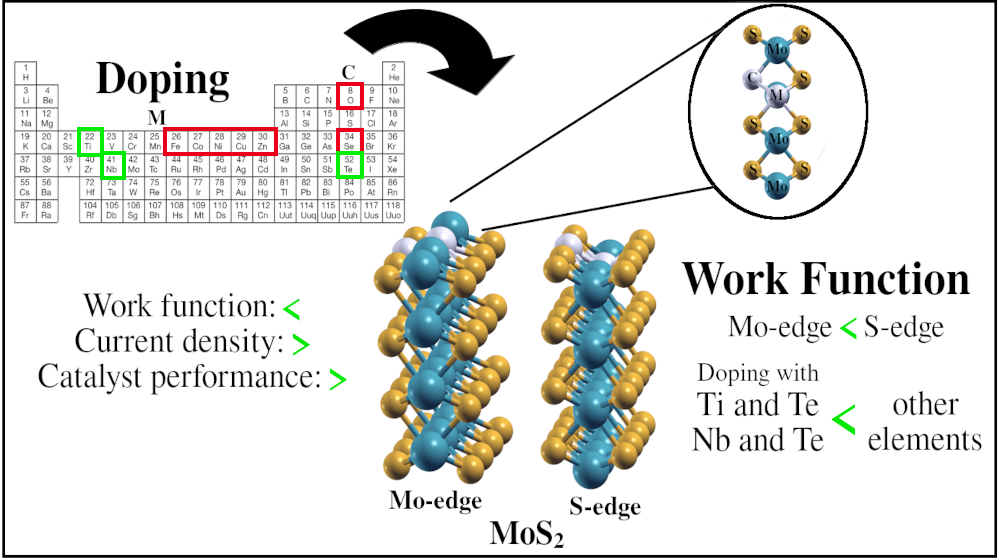

# MoS2-catalyst-ChemPhys
The development of efficient technologies that enable the use of CO2 as a raw material for the synthesis of high-value-
added products is extremely important. Electrochemical methods are being considered promising to achieve this goal.
However, significant efforts still need to be made in developing more efficient and low-cost electrocatalysts. With the
aim of assisting in the planning of more efficient electrocatalysts, this work investigated, through DFT electronic struc-
ture calculations, the structure and properties of pure MoS2 and doped with various elements (Fe, Zn, Ni, Cu, Co, Ti,
Nb, O, Se, Te), in addition to the S vacancy. The results obtained indicate that doping with Nb or Ti elements provides a
greater reduction in the work function of MoS2. Works found in the literature shows that there is a correlation between
the work function and current density. The lower the material’s work function, the higher the reaction current density
and the better the material’s performance as an electrocatalyst. Furthermore, the results indicate that the formation
energies of the COOH* and CHO* intermediates in MoS2 doped with Nb or Ti are more stable than those of the CO*
intermediate. The high stability of the binding energy of the CO* intermediate in relation to other intermediates rep-
resents a limitation for the catalytic efficiency of transition metal catalysts for the electroreduction of CO2 to products
with higher added value. These results are important and promising, since MoS2-based materials are used as catalysts
in several reactions, such as oxygen reduction, hydrodesulfurization and hydrogen evolution (HER).

To cite this works, please use this as reference:

```
@Article{Vaiss2025,
author ="Viviane Vaiss and Luciano T. Costa",
title  ="Theoretical Systematic investigation as a Strategic Tool for the design of more efficient pure and doped MoS2 catalysts for CO2 Electroreduction",
journal  ="Chemical Physics",
year  ="2025",
volume  ="",
issue  ="",
pages  ="",
publisher  ="Elsevier",
doi  ="",
}
```

Although there are several works in the literature studying the potential of pure and doped MoS2 as electrocatalysts for
the CO2 reduction reaction, no work was found that carried out a systematic study of the electronic properties, work func-
tion and doping energy. Therefore, in this work, we systematically investigated the properties of pure and doped MoS2
electrocatalysts from DFT calculations with periodic boundary conditions. The aim is to assist in the planning of more
efficient catalysts used in the CO2 electroreduction reaction. To this purpose, the work function, Bader charges, projected
density of states (PDOS) and the doping energy of all structures obtained by doping in MoS2 on the molybdenum and
sulfur edges were calculated. In addition, the electronic energies of the formation of the intermediates COOH*, CO*, and
CHO* were calculated for the materials that obtained lower work function values.

# Table of Contents, Graphical Abstracts



### Contents

Two folders are available, **input** and **optimized-geometries**. 

